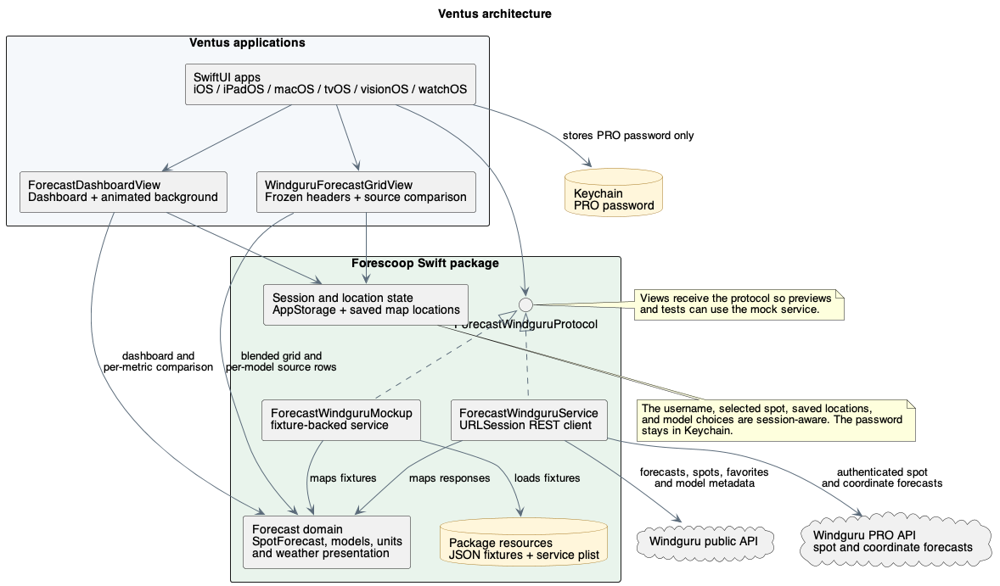

# Ventus

Ventus is a SwiftUI weather-forecast app powered by Windguru. Its shared `Forescoop` Swift package provides the forecast client, typed domain models, unit conversions, persistence helpers, and reusable views used by the Apple-platform example targets.

Ventus is the user-facing app name. The package product and Swift module remain `Forescoop` for source compatibility.



The editable source for this diagram is [docs/architecture.puml](docs/architecture.puml).

## Highlights

- Live Windguru public and PRO forecasts, spot search, favorites, model metadata, and authenticated exact-coordinate forecasts.
- SwiftUI dashboards and a Windguru-inspired forecast grid for iPhone, iPad, macOS, tvOS, visionOS, and watchOS.
- Forecast-model multi-selection with a local equal-weight **Forescoop Mix**, including circular wind-direction averaging and per-model source comparisons.
- Explicit units for wind, temperature, precipitation, freezing level, and sea-level pressure.
- A weather-aware native SwiftUI animated background shared by the dashboard and forecast grid, including wind, clouds, rain, snow, and atmospheric effects.
- Saved map locations, public Windguru spots, and account favorites, with location-aware model availability.
- Fixture-backed mock service for SwiftUI previews and tests that do not make network requests.

## Platforms and targets

The package requires Swift tools 6.2 and Apple platform version 26.0 or later.

| Target | Experience |
| --- | --- |
| iOS / iPadOS | Ventus dashboard and forecast grid, spot/map picker, favorites, saved locations, model comparison, and Windguru sign-in |
| macOS | Wide dashboard with the saved-location map workspace |
| visionOS | Dedicated SwiftUI forecast window and a separate Locations window |
| watchOS | Compact forecast and persistent local spot selector |
| tvOS | Native SwiftUI forecast experience |

`iOSnowatch` is an iOS-only sample target. `ForescoopWatchOnly` is a separate watchOS app whose companion is `iOSnowatch`.

## Add the framework

Add this repository in Xcode's **Package Dependencies** UI, or declare it in a package manifest:

```swift
.package(url: "https://github.com/patagonia2019/forescoop.git", from: "0.1.0")
```

Add the `Forescoop` product to your target, then import it:

```swift
import Forescoop
```

The package container is named `ForescoopPackage`; its public library product and module are both named `Forescoop`.

## Run the examples

Open [Example/Forescoop.xcodeproj](Example/Forescoop.xcodeproj) in Xcode. It resolves the local Swift package directly and contains shared schemes for iOS, macOS, tvOS, visionOS, and watchOS.

To exercise the framework and its bundled fixtures from the command line:

```sh
swift test
```

## Forecast data, accounts, and privacy

The dashboard starts with Windguru's live public forecast service and defaults to spot `64141` when no account preference is available. It remembers the active spot and saved map locations. A signed-in user's first Windguru favorite becomes the initial spot when available. The username is stored with app preferences; the password remains only in Keychain.

Public users can load Windguru spots and use the device's current location to resolve a public spot. Windguru PRO enables exact latitude/longitude forecasts and additional models where Windguru makes them available. Model lists are scoped to the active spot or coordinate and are refreshed when the location or account session changes.

The dashboard and grid can blend selected models into a local **Forescoop Mix**. When more than one model is selected, the comparison controls reveal the original source values per metric. PRO response fields are normalized so integer and decimal values render consistently for wind speed, wind direction, and freezing level.

For offline previews and tests, inject `ForecastWindguruMockup`; it reads JSON fixtures from `Sources/Forescoop/Resources` through `Bundle.module`.

## Architecture

The example apps depend on `ForecastWindguruProtocol`, rather than on the network implementation directly. `ForecastWindguruService` uses `URLSession` to map public and PRO Windguru responses into the shared forecast domain. `ForecastWindguruMockup` implements the same protocol with bundled fixtures.

The [PlantUML source](docs/architecture.puml) is the canonical diagram. Regenerate `docs/architecture.png` with PlantUML after changing it:

```sh
plantuml -tpng docs/architecture.puml
```

## Migration notes

The former standalone migration log is maintained here.

- The internal library was migrated to the root Swift package, with resources processed by Swift Package Manager and loaded through `Bundle.module`. Legacy dependency-manager configuration, generated workspace metadata, framework references, and build phases were removed.
- Every package and example target has a 26.0 deployment target. The Xcode project links the local `Forescoop` product directly for iOS, watchOS, macOS, tvOS, and visionOS.
- UIKit view controllers and the main storyboard were removed in favor of SwiftUI app lifecycles across the example targets.
- The SwiftUI `ForecastDashboardView` provides the adaptive dashboard, while `WindguruForecastGridView` provides the dense horizontal forecast grid. Both share the animated weather background and selected-hour state.
- Forecast display is based on the current local day, so an hour key of `27` means tomorrow at 03:00. The detail view includes wind speed, gusts, direction, cloud cover, humidity, precipitation, freezing level, waves, and pressure, with selectable units.
- The available models are discovered for the active spot or coordinate. Multiple selected models form the local `Forescoop Mix`; Windguru's metadata-only `WG` mix is not used.
- The location flow supports public search, device/map selection, favorites, saved locations, and the Windguru PRO exact-coordinate path. Search-derived saved locations retain their resolved spot ID.
- Forecast models are tied to the active spot or coordinate rather than global settings. Signing in or out clears session-scoped model and location state before reloading the forecast.
- The forecast grid supports frozen row and hour labels, per-metric source comparison, and model selection in the grid. Dashboard comparison uses the same per-metric expansion behavior for the selected hour.
- visionOS uses a native `App`/`WindowGroup` lifecycle, and the watchOS app uses its own local saved locations because its container is separate from the iPhone app.

## License

Forescoop is available under the MIT license. See [LICENSE](LICENSE).

## Author

southfox — javier.fuchs@gmail.com
